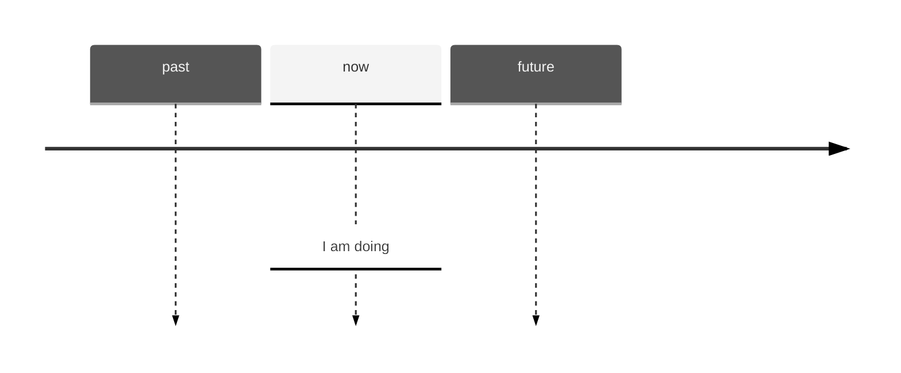
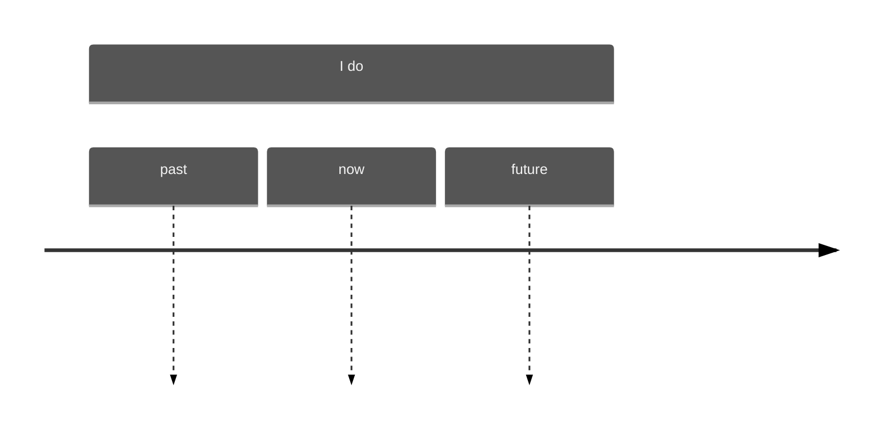

# Present Continuous (I'm doing)

## Part A

**am/is/are + -ing** is *present continuous*.

I am driving -> I'm driving now, **at the time of speaking**. And the action is not finished.

He is working -> He's working now, **at the time of speaking**. And the action is not finished.

|||||
|-|-|-|-|
|I|**am**|(=I'm)|driving|
|he/she/it|**is**|(=he's etc.)|working|
|we/you/they|**are**|(=we're etc.)|doing etc.|

## Part B

I am doing something = **I started doing it and I haven't finished; I'm in the middle of doing it**.
- Please don't make so much noise. I**'m trying** to work. (*not* I try)
- 'Where's Mark?'; 'He's having a shower'. (*not* He has a shower)
- Let's go out now. It isn't raining any more. (*not* It doesn't rain)

Sometimes the action is not happening at the time of speaking. For example:
- Kate wants to work in Italy, so she**'s learning** Italian. (but perhaps she isn't learning Italian at the time of speaking)
- Some friends of mine **are building** their own house. They hope to finish it next summer. (again, they aren't building at the time of speaking)

## Part C

You can use the *present continuous* with **today** / **this week** / **this year** etc. (periods around now):
- You**'re working** hard **today**. (*not* You work hard today)
- The company I work for **isn't doing** so well **this year**.

## Part D

We use *present continuous* when we talk about **a change that has started to happen**. We often use these verbs in this way:
- **getting**, **becoming**, **changing**, **improving**, **starting**, **beginning**, **increasing**, **rising**, **falling**, **growing**
  - Is your English getting better? (*not* Does your English get better)
  - The population of the world **is Increasing** very fast. (*not* increases)
  - At first I didn't like my job, but I**'m starting** to enjoy it now. (not I start)

# Present Simple (I do)

## Part A

**drive**(**s**), **work**(**s**), **do**(**es**) etc. is the *present simple*.

|||
|-|-|
|I/we/you/they|**drive**/**work**/*8do** etc.|
|he/she/it|**drives**/**works**/**does** etc.|

## Part B

We use the present simple to talk about **things in general**. We use it to say that **something happens all the time or repeatedly**, or that **something is true in general**:
- Nurses **look** after patients in hospitals.
- I usually **go** away at weekends.
- The earth **goes** round the sun.
- The cafe **opens** at 7.30 in the morning.

We say:

- I **work** *but* he **works**; you **go** *but* it **goes** 
- They **teach** *but* my sister **teaches**; I **have** *but* he **has**

> For Spelling
> vers + -**s**/-**es** (after **he**/**she**/**it**) -> works, enjoys, washes
>
> The ending is -**es** when thw word ends in -**s**/-**ss**/-**sh**/-**ch**/-**x**:
> - bu**s**/bus**es**; mi**ss**/miss**es**, wa**sh**/wash**es**
> - mat**ch**/match**es**, sear**ch**/search**es**, bo**x**/box**es**
> Note also:
> - potato/potato**es**, tomato/tomato**es**, do/do**es**, go/go**es**
>
> Words ending in -**y** (bab**y**, carr**y**, eas**y** etc.)
> if a word ends in a consonant[^1] + **y** (-**by**/-**ry**/-**sy**/-**vy** etc.)
> **y** changes to **ie** before the ending -**s**:
> - hurr**y**/hurr**ies**, stud**y**/stud**ies**, appl**y**/appl**ies**, tr**y**/tr**ies**
> 
> **y** does *not* change if the word ends in a *vowel*[^1] + **y**(-**ay**/-**ey**/-**oy**/-**uy**)
> - pl**ay**/pl**ays**/pl**ayed**, monk**ey**/monk**eys**, enj**oy**/enj**oys**, b**uy**/b**uys**
> An exception is: d**ay**/d**aily**
{: .prompt-tip }

## Part C

We use **do**/**does** to make **questions and negative sentences**:

||Questions sentences||
|-|-|-|
|**do**|I/we/you/they|**work**/**drive**/**do**?|
|**does**|he/she/it|**work**/**drive**/**do**?|

||Negative sentences||
|-|-|-|
|I/we/you/they|**don't**|**work**/**drive**/**do**|
|he/she/it|**doesn't**|**work**/**drive**/**do**|

- I come from Canada. Where **do** you **come** from?
- I **don't go** away very often.
- What **do** you **do** (**do** is also the main verb, do you **do**/ doesn't **do** etc.)
- He's always so lazy. He **doesn't do** anything to help.

## Part D

We use the *present simple* to say **how often we do things**:
- **I get** up at 8 o'clock **every morning**.
- **How often do** you **go** to the dentist?
- Julie **doesn't drink** tea **very often**.
- Robert usually **goes** away **two or three times a year**.

## Part E

Sometimes we do things by saying something. For example, when you promise to do something, you can say '**I promise**...'; when you suggest something, you can say '**I suggest**...'
- **I promise** I won't be late. (*not* I'm promising)
- 'What do **you suggest** I do?'; '**I suggest** that you...'

In the same way we say: **I apologise**.../**I advise**.../**I insist**.../***I agree**.../**I refuse**... etc.

# Present Continuous and Present Simple 1

## Part A

*present continuous* (**I am doing**)

We use the *continuous* for things happening **at or around the time of speaking**.

Example:
- The water **is boiling**. Be careful
- Let's go out. It **itn's raining** now.
- 'I'm busy.'; 'What **are** you **doing**?
- I**'m getting** hungry. Let's go and eat.
- The population of the world **is increasing** very fast.
- I**'m learning** to drive. My driving test is next month. My father **is teaching** me.

We use the *continuous* for *temporary* situations(things that continue for a short time):
- I**'m living** with some friends until I find a place of my own.
- 'You**'re working** hard today.'; 'Yes, I have a lot to do.'

*present simple* (**I do**)

We use the *simple* for **things in general or things that happen repeatedly**.

Example:
- Water **boils** at 100 degrees Celsius.
- It **doesn't rain** very much in summer.
- What **do** you usually **do** at weekends?
- I always **get** hungry in the afternoon.
- Every day the population of the world **increases** by about 200000 people.
- I'm not very active. I **don't do** any sport.
- It took me an hour to get to work this morning. Most days it doesn't take so long.

We use the *simple* for *permanent* situations(things that continue for a long time):
- My parents **live** in London. That have lived there all their lives.
- Joe isn't lazy. He **works** hard most of the time.

## Part B

**I always do** and **I'm always doing**

I **always do** something = I do it every time:
- I **always go** to work by car. (*not* I'm always going)
- They don't get on well. They're always arguing

I**'m always doing** something = I do it **too often or more often than normal**.
- I've lost my keys again. I**'m always losing** them. -> I**'m always losing** them = I lose them too often, or more often than normal.
- Paul is never satisfied. He**'s always complaining**. (=he complains too much)
- You**'re always looking** at your phone. Don't you have anything else to do?
- 'The car has broken down again.'; 'That car is useless. It**'s always broking** down.'
- 'Look! You've made the same mistake again.'; 'Oh no, not again! I**'m always making** the same mistake.'

[^1]: **a** **e** **i** **o** **u** are *vowel* letters. The other letters(**b** **c** **d** **f** **g** etc.) are *consonant* letters.
