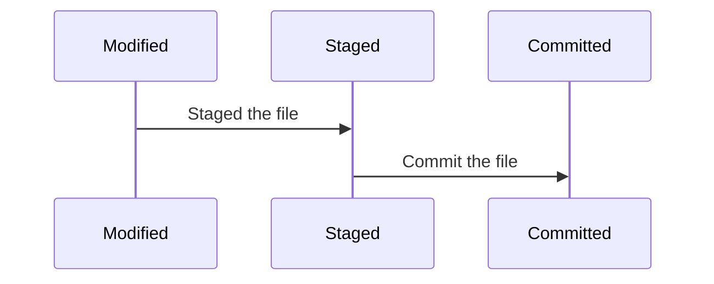
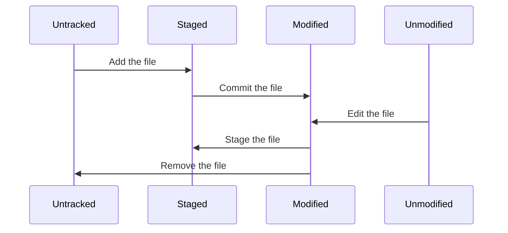

# Overview

## Git states

Every file managed by Git has three main states: *modified*, *staged* and *committed*:
- A file is considerd modified if it has modified since being checked out from the last version and hasn't yet been committed to the Git repository.
- Staged means that this file was marked to go into the next committed version.
- Committed means that the data is safely stored in local Git repository.



The *modified* state corresponds to the *Working Directory*, the *staged* state corresponds to the *Staging Area*, and the *committed* state corresponds to the *Git Repository*.

And the basic Git workflow consist of the following steps:
1. Chech out the latest version from *Git Repository* into your *Working Directory*
2. Modify files in your *Working Directory*
3. Selective stage those changes you want to be part of next commit, which takes the files from *Working Directory* to *Staging Area*
4. Commit the staged changes, which takes the files from *Staging Area* to *Git Repository*

## File status

Each file in Git in your working directory can be in one of two states: *tracked* or *untracked*. Tracked files are files that were in the last snapshot, as well as any newly staged files; they can be *unmodified*, *modified*, or *staged*.

Untracked files are everything else--any files in your working directory that were not in your last snapshot and are not in your staging area.



We can check which files are in which state by using the command:

```bash
git status
```

## Config

We can use a tool called `git config` to get and set configuration variables that control all aspects of how Git looks and operates. These variables can be stored in three different places:
1. The `/etc/gitconfig`{: .filepath } file contains variables applied to every user and their repositories on this system. When we pass the `--system` option to `git config`, Git reads and writes from and to this file.
2. The `~/.gitconfig`{: .filepath } file contains variables applied to personally user and all his repositories. When we pass the `--global` option to `git config`, Git reads and writes from and to this file, and it affects all of the repositories that the current user works with on this system.
3. The `.git/config`{: .filepath } file contains variables applied to a single Git repository. When we pass the `--local` option to `git config`, Git reads and writes from and to this file.

Each level overrides values in the previous level, so values in `~/.gitconfig` take precedence over those in `/etc/gitconfig`.

We can view all of our settings along with their source locations using the command:

```bash
git config --list --show-origin
# or (without coming from)
git config --list
```

There are some keys displayed in this list occur more than once, since Git reads the same key from different files, but Git uses the last value of that key.

We can check what Git considers the value of a specific key:

```bash
git config core.editor
# or, if you want to check which final file that is coming from, do:
git config --show-origin core.editor
```

### First Time Setup

- Setup your identity.

```bash
git config --global user.name "NishikiChisato"
git config --global user.email NishikiChisato@outlook.com
```

- Setup your editor

```bash
git config --global core.editor nvim
```

- Setup your default branch name

```bash
git config --global init.defaultBranch main
```

