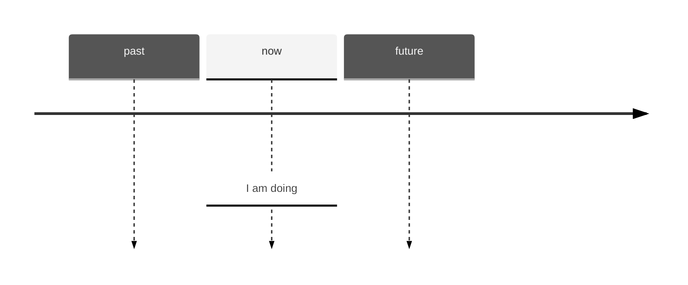
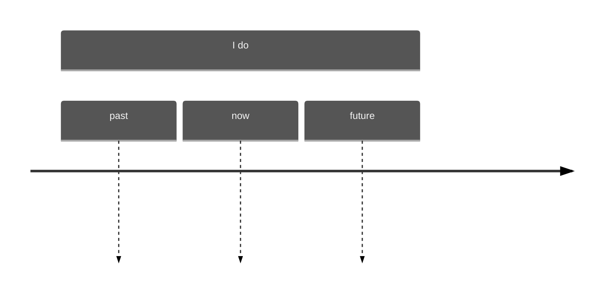
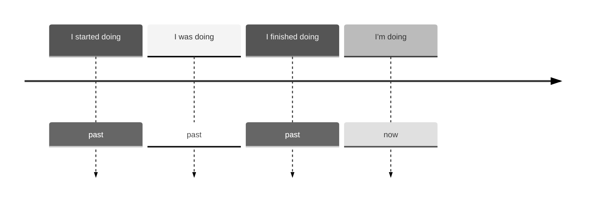

# Present Continuous (I'm doing)

## Part 1A

**am/is/are + -ing** is *present continuous*.

I am driving -> I'm driving now, **at the time of speaking**. And the action is not finished.

He is working -> He's working now, **at the time of speaking**. And the action is not finished.

|||||
|-|-|-|-|
|I|**am**|(=I'm)|driving|
|he/she/it|**is**|(=he's etc.)|working|
|we/you/they|**are**|(=we're etc.)|doing etc.|

## Part 1B

I am doing something = **I started doing it and I haven't finished; I'm in the middle of doing it**.
- Please don't make so much noise. I**'m trying** to work. (*not* I try)
- 'Where's Mark?'; 'He's having a shower'. (*not* He has a shower)
- Let's go out now. It isn't raining any more. (*not* It doesn't rain)

Sometimes the action is not happening at the time of speaking. For example:
- Kate wants to work in Italy, so she**'s learning** Italian. (but perhaps she isn't learning Italian at the time of speaking)
- Some friends of mine **are building** their own house. They hope to finish it next summer. (again, they aren't building at the time of speaking)

## Part 1C

You can use the *present continuous* with **today** / **this week** / **this year** etc. (periods around now):
- You**'re working** hard **today**. (*not* You work hard today)
- The company I work for **isn't doing** so well **this year**.

## Part 1D

We use *present continuous* when we talk about **a change that has started to happen**. We often use these verbs in this way:
- **getting**, **becoming**, **changing**, **improving**, **starting**, **beginning**, **increasing**, **rising**, **falling**, **growing**
  - Is your English getting better? (*not* Does your English get better)
  - The population of the world **is Increasing** very fast. (*not* increases)
  - At first I didn't like my job, but I**'m starting** to enjoy it now. (not I start)

# Present Simple (I do)

## Part 2A

**drive**(**s**), **work**(**s**), **do**(**es**) etc. is the *present simple*.

|||
|-|-|
|I/we/you/they|**drive**/**work**/*8do** etc.|
|he/she/it|**drives**/**works**/**does** etc.|

## Part 2B

We use the present simple to talk about **things in general**. We use it to say that **something happens all the time or repeatedly**, or that **something is true in general**:
- Nurses **look** after patients in hospitals.
- I usually **go** away at weekends.
- The earth **goes** round the sun.
- The cafe **opens** at 7.30 in the morning.

We say:

- I **work** *but* he **works**; you **go** *but* it **goes** 
- They **teach** *but* my sister **teaches**; I **have** *but* he **has**

> For Spelling
>
> TODO: refer Appendix 6
{: .prompt-tip }

## Part 2C

We use **do**/**does** to make **questions and negative sentences**:

||Questions sentences||
|-|-|-|
|**do**|I/we/you/they|**work**/**drive**/**do**?|
|**does**|he/she/it|**work**/**drive**/**do**?|

||Negative sentences||
|-|-|-|
|I/we/you/they|**don't**|**work**/**drive**/**do**|
|he/she/it|**doesn't**|**work**/**drive**/**do**|

- I come from Canada. Where **do** you **come** from?
- I **don't go** away very often.
- What **do** you **do** (**do** is also the main verb, do you **do**/ doesn't **do** etc.)
- He's always so lazy. He **doesn't do** anything to help.

## Part 2D

We use the *present simple* to say **how often we do things**:
- **I get** up at 8 o'clock **every morning**.
- **How often do** you **go** to the dentist?
- Julie **doesn't drink** tea **very often**.
- Robert usually **goes** away **two or three times a year**.

## Part 2E

Sometimes we do things by saying something. For example, when you promise to do something, you can say '**I promise**...'; when you suggest something, you can say '**I suggest**...'
- **I promise** I won't be late. (*not* I'm promising)
- 'What do **you suggest** I do?'; '**I suggest** that you...'

In the same way we say: **I apologise**.../**I advise**.../**I insist**.../***I agree**.../**I refuse**... etc.

# Present Continuous and Present Simple 1

## Part 3A

*present continuous* (**I am doing**)

We use the *continuous* for things happening **at or around the time of speaking**.

Example:
- The water **is boiling**. Be careful
- Let's go out. It **itn's raining** now.
- 'I'm busy.'; 'What **are** you **doing**?
- I**'m getting** hungry. Let's go and eat.
- The population of the world **is increasing** very fast.
- I**'m learning** to drive. My driving test is next month. My father **is teaching** me.

We use the *continuous* for *temporary* situations(things that continue for a short time):
- I**'m living** with some friends until I find a place of my own.
- 'You**'re working** hard today.'; 'Yes, I have a lot to do.'

*present simple* (**I do**)

We use the *simple* for **things in general or things that happen repeatedly**.

Example:
- Water **boils** at 100 degrees Celsius.
- It **doesn't rain** very much in summer.
- What **do** you usually **do** at weekends?
- I always **get** hungry in the afternoon.
- Every day the population of the world **increases** by about 200000 people.
- I'm not very active. I **don't do** any sport.
- It took me an hour to get to work this morning. Most days it doesn't take so long.

We use the *simple* for *permanent* situations(things that continue for a long time):
- My parents **live** in London. That have lived there all their lives.
- Joe isn't lazy. He **works** hard most of the time.

## Part 3B

**I always do** and **I'm always doing**

I **always do** something = I do it every time:
- I **always go** to work by car. (*not* I'm always going)
- They don't get on well. They're always arguing

I**'m always doing** something = I do it **too often or more often than normal**.
- I've lost my keys again. I**'m always losing** them. -> I**'m always losing** them = I lose them too often, or more often than normal.
- Paul is never satisfied. He**'s always complaining**. (=he complains too much)
- You**'re always looking** at your phone. Don't you have anything else to do?
- 'The car has broken down again.'; 'That car is useless. It**'s always broking** down.'
- 'Look! You've made the same mistake again.'; 'Oh no, not again! I**'m always making** the same mistake.'

# Present Continuous and Present Simple 2

This unit focus on some verb usually used in *present simple*, instead of *present continuous*.

## Part 4A

We use *continuous* forms (I**'m waiting**, it**'s raining** etc.) **for actions and happenings that have started bug not finished**.

**Some verbs (for example, **know** and **like**) are not normally used in this way**. We don't say 'I am knowing', 'they are liking'. we say 'I **know**', 'they **like'.

The following verbs are **not normally used** in the *present continuous*.

||||||
|-|-|-|-|-|
|like|want|need|prefer|
|know|realise|understand|recognise|
|believe|suppose|remember|mean|
|belong|fit|contain|consist|seem|

- I'm hungry. I **want** something to eat. (*not* I'm wanting).
- **Do** you **understand** what I **mean**?
- Anna **doesn't seem** very happy right now.
- Don't put the dictionary away. I **need** it. (*compare* Don't put the dictionary away. I**'m using** it)
- Alan says he's 90 years old, but nobody **believes** him.
- She told me her name, but I **don't remember** it now.
- Gary wasn't well earlier, but he **seems** OK now.

## Part 4B

The usage of *think*.

When **think** means 'believe' or 'have an opinion', **we do not use the *continuous***.
- I **think** Mary is Canadian, but I'm not sure. (*not* I'm thinking)
- What **do** you **think** of my idea? (= what is your opinion?)
- I can't make up my mide. What **do you think** I should do?

When **think** means 'consider', **the *continuous* is possible**:
- I**'m thinking** about what happened. I often **think** about it.
- Nicky **is thinking** of giving up her job. (= she is considering it)
- 'Are you OK? You look worried.'; 'I**'m thinking**'
- I**'m thinking** of selling my car. Yould you be interested in buying it?

## Part 4C

The usage of *see*, *hear*, *smell*, *taste*, *look*, *feel*

We normally use the *present simple* (not *continuous*) with **see**/**hear**/**smell**/**taste**
- **Do** you **see** that man over there? (*not* are you seeing)
- The room **smells**. Let's open a window.
- This soup **doesn't taste** very good.

You can use the *present simple* **or** *present continuous* to say how somebody **looks** or **feels** now:
- You **look** well today. *or* You**'re looking** well today.
- How **do** you **feel** now? *or* How **are** you **feeling** now?
*but*
- I usually **feel** tired in the morning. (*not* I'm usually feeling)

For the sake of accuracy, we use the *present simple*.

## Part 4D

You can say **he's being**..., **you're being**... etc. to say **how somebody is behaving now**:
- I can't understand why he**'s being** so selfish. He isn't usually like that. (**being** selfish = behaving selfishly now)
- 'The path is icy. Don't slip.'; 'Don't worry. I**'m being** very careful.'
Compare:
- He never thinks about other people. He**'s** very selfish. (= he is selfish generally, now only now)
- I don't like to take risks. I**'m** a very careful person.

We use **am**/**is**/**are being** to say how a person is *behaving* (= **doing something they can control**) now. It's not usually possible in other situations:
- Sam **is** ill. (*not* is being ill, ill can't be control)
- **Are** you tired? (*not* are you being tired, tired can't be control)

There are two key points here:
- Doing something they can control.
- Doing something at or around the time of speaking.

Check the following examples:
- Sarah **is being** very nice to me at the monment. I wonder why. (can control, around the time of speaking)
- They **are** very happy. They've just got married. (can control, not around the time of speaking)
- Would you like something to eat? **Are you** hungry? (can't control, around the time of speaking)

# Past Simple (I did)

## Part 5A

Very often the *past simple* ends in -**ed** (*regular* verbs):
- I work in a travel agency now. Before that I **worked** in a department store.
- They **invited** us to their party, but we **decided** not to go.
- The police **stopped** me on my way home last night.
- Laura **passed** her exam because she **studied** very hard.

> For Spelling
>
> TODO: refer Appendix 6
{: .prompt-tip }

But many verb are *irregular*. The *past simple* does *not* end in -**ed**. For example:
- write -> **wrote**
  - Mozart **wrote** more than 600 pieces of music.
- see -> **saw**
  - We **saw** Alice in town a few days ago.
- go -> **went**
  - I **went** to the cinema three times last week.
- shut -> **shut**
  - It was cold, so I **shut** the window.

> For a list of irregular verbs
>
> TODO: refer Appendix 1
{: .prompt-tip }

## Part 5B

In questions and negative sentences we use **did**/**didn't** + infinitive:

|||
|-|-|
|I|enjoy**ed**|
|she|**saw**|
|they|**went**|

||||
|-|-|-|
|**did**|you|**enjoy**|
|**did**|she|**see**|
|**did**|they|**go**|

||||
|-|-|-|
|I|**didn't**|**enjoy**|
|she|**didn't**|**see**|
|they|**didn't**|**go**|

- I enjoyed the party a lot. **Did** you **enjoy** it?
- How many people **did** they **invite** to the wedding?
- I **didn't buy** anything because I **didn't have** any money.

Sometimes **do** is the main verb in the sentence (did you **do**?, I didn't **do**):
- What **did** you **do** at the weekend? (*not* What did you at the weekend?)
- I **didn't do** anything. (*not* I didn't anything)

## Part 5C

The past of **be** (**am**/**is**/**are**) is **was**/**were**:

|||
|-|-|
|I/he/she/it|**was**/**were**|
|we/you/they|**was**/**were**|

|||
|-|-|
|**was**|I/he/she/it|
|**were**|we/you/they|

- **I was** annoyed because **they were** late.
- **Was the weather** good when **you were** on holiday?
- **I wasn't** able to come because **they were** so busy.
- **I wasn't** hungry, so I didn't eat anything.
- Did you go out last night ot **were you** too tried?

# Past Continuous (I was doing)

## Part 6A

Yesterday Karen and Joe played tennis. They started at 10o'clock and finished at 11.30. So, at 10.30 they **were playing** tennis.

they **were playing** = they were in the middle of playing, they had not finished

**was**/**were + -ing** is the past continuous:

||||
|-|-|-|-|
|he/she/it|**was**|**playing**|
|we/you/they|**were**|**doing** etc.|

## Part 6B

I **was doing** something = I was in the middle of doing it at a certain time. The action or situation started before this time, but had not finished:

- This time last year I **was living** in Hong Kong.
- What **were** you **doing** at 10o'clock last night?
- I waved to Helen, but she **wasn't looking**.

## Part 6C

Compare I **was doing** (*past continuous*) and I **did** (*past simple*):

|I **was doing** (= in the middle of an action)|I **did** (= complete action)|
|-|-|
|We were **walking** home when I met Dan. (in the middle of walking home)|We **walked** home after the party last night. (= all the way, completely)|
|Kate **was watching** TV when we arrived.|Kate **watched** TV a lot when she was ill last year.|

## Part 6D

You can say that something **happened** (*past simple*) in the middle of something else (*past continuous*):
- Matt **phoned** while we **were having** dinner.
- It **was raining** when I **got** up.
- I **saw** you in the park Yesterday. You **were sitting** on the grass and **reading** a book.
- I **hurt** my back while I **was working** in the garden.
- I **was walking** along the street when suddenly I **heared** something behind me. Somebody **was following** me. I was scared and I started to run.

But we use the past simple to say that one thing happened *after* another:

- I **was walking** along the road when I **saw** Dan. So I **stopped**, and we **talked** for a while.
- 'Did you go out last night?'; 'No, I was too tired.'

Compare:

- When Karen arrived, we **were having** dinner. (= we had already started before she arrived)
- When Karen arrived, we **had** dinner. (= Karen arrived, and then we had dinner)

## Part 6E

Some verbs (for example, **know** and **want**) are not normally used in continuous forms (**is** + -**ing**, **was** + -**ing** etc.)
- We were good friends. We **know** each other well. (*not* we were knowing)
- I was enjoying the party, but Chris **wanted** to go home. (*not* was wanting)
