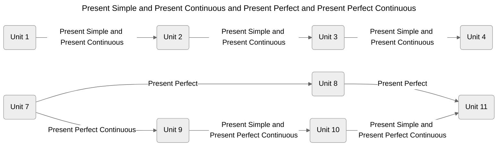
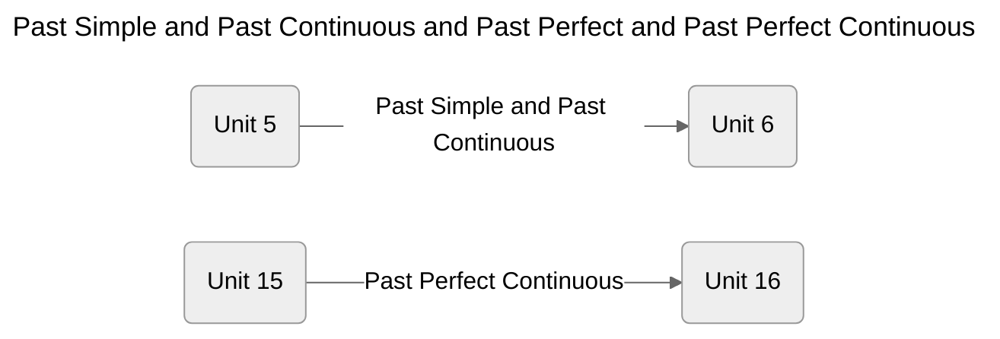
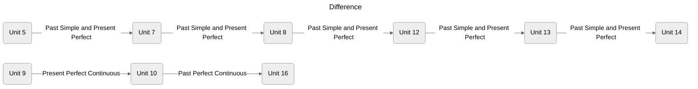
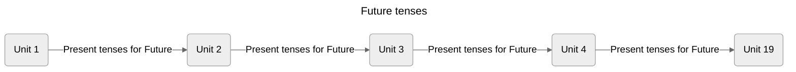
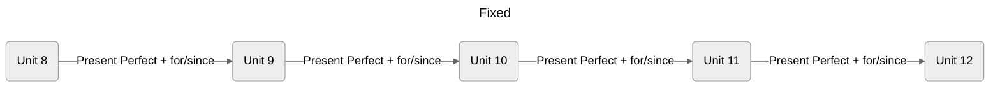

# Overview












```mermaid
---
title: Single
--- 
%%{init: { 'logLevel': 'debug', 'theme': 'neutral' } }%%
flowchart LR
  u4(Unit 4) -->|have/have got| u17(Unit 17)
  u7(Unit 7) -->|been to| u8(Unit 8) & u126(Unit 126)
  u18(Unit 18) -->|used to|
```
