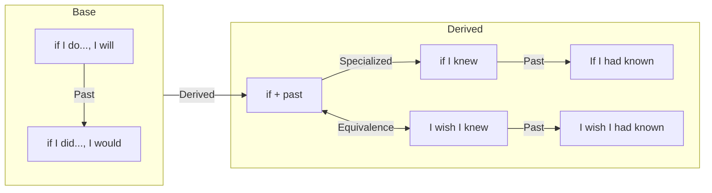

<!--toc:start-->
- [Unit 38: if I do … and if I did …](#unit-38-if-i-do-and-if-i-did)
- [Unit 39: if I knew … I wish I knew](#unit-39-if-i-knew-i-wish-i-knew)
- [Unit 40: if I had known … I wish I had known …](#unit-40-if-i-had-known-i-wish-i-had-known)
- [Unit 41: wish](#unit-41-wish)
- [Summary](#summary)
  - [The Basics](#the-basics)
  - [if + past](#if-past)
  - [If I knew… I wish I knew](#if-i-knew-i-wish-i-knew)
  - [Present and Past](#present-and-past)
<!--toc:end-->

## Unit 38: if I do … and if I did …

1. Different tences
    - For present, if I do…, I will… → means it’s possible to do it
        - If I take the bus, it will be cheaper.
    - For past, if I did…, I would… → means I’m not going to do it
        - If I took the bus, it would be cheaper.
2. Indicate hypothetical situation
    - When we talk about something that will not happen or we don’t expect that it will happen, we use if + past, but meaning is not past.
        - If you found a wallet in the street, what would you do with it. → if-part is past, non if-part is also past.
        - If there was an election tomorrow, who would you vote for.
        - If you had a new MacBook now, what would you do with it.
3. We normally don’t use would/wouldn’t in the if-part, but in the non if-part. Besides, we can use might or could to exchange would
    - If I won a lot of money, I would/might/could buy a house.
    - If I had a new MacBook, I would/might/could use it to write code.

## Unit 39: if I knew … I wish I knew

1. When we image what we would do in a situation, we use if + past (if I knew/if you were/if we did etc.), but the meaning is present, not past. → the same as Unit 38 concept 2
    - There are many things I would like to do if I had more time.
    - If you were my position, what would you do.
    - If I didn’t want to go to the part, I wouldn’t go.
2. We use wish + past (I wish I knew/I wish you were etc.) to say that we regret something, or something is not as we would like it to be.
    - I wish I knew Paul’s phone number. (I don’t know it and I regret this)
    - It’s very crowded here. I wish there weren’t so many poeple. (there are a lot of people)
    - I wish I could have a MacBook. (something is regret)
3. After if and wish, we can use were instead of was, but we can also use was.
    - If I were you… or If I was you…
    - I would go for a walk if it weren’t so cold. or I would go for a walk if it wasn’t so cold.
    - I wish Anna were here. or I wish Anna was here.
    - I wish the weather were good. or I wish the ewather was good.
4. Similary with Unit 38.3, we don’t use if … would.
    - If I were rich, I would travel a lot.
    - Who would you ask if you needed help.
    - I wish I had something to read. (not I wish I would have)
    - I wish she were here now. (not I wish she would be)
5. Could somethimes means ‘would be able to’ and sometimes ‘was/were able to’, so could can use in if part (was/were able to) and non-if part (would be able to)
    - She could get a better job if she could speak another language. (She would be able to get a better job if she was able to speak another language.) → could can use in if and non-if part.
    - I wish I could help you. (I wish I were able to help you)

## Unit 40: if I had known … I wish I had known …

1. We use if + had (done) to talk about past. → if + past simple means present, if + past perfect means past.
    - If I had known you were in hospital, I would have gone to visit you. (I didn’t know, so I didn’t go to visit you. past tences)
    - They didn’t go out last night. They would have gone out if they hadn’t been so tired. (they were so tired, also past tences)
    - The view is wonderful. I would have taken some picutres if I’d had a camera with me. (I didn’t have camera)
    - Comparing the following two sentences:
        - I’m not hungry. If I was hungry, I would eat something. (now)
        - I was not hungry. If I had been hungry, I would have eaten something. (past)
2. We use would in the non-if part, instead of if part
    - If I had seen you, I would have said hello. (not If I would have seen you)
    - The short form ‘d can be would and had. We can use the form of following verb to judge
        - If I’d seen you. → If I had seen you
        - I’d have said hello. → I would have said hello.
3. We can use past perfect (had done/known/been etc.) in the same way after wish
    - I wish something had happened. → I’m sorry that it didn’t happen.
    - I wish something hadn’t happened. → I’m sorry that it happened.
    - I wish I had known that Gary was ill. I would have gone to seen him. (but I didn’t know)
    - I feel sick. I wish I hadn’t eaten so much. (but I ate too much)
4. Compare would (do) and would have (done)
    - If I had gone to party last night, I would be tired now. (I’m not tired now, present)
    - If I had gone to party last night, I would have met lots of people. (I didn’t meet lots of people, past)
5. Compare would have (done), could have (done), might have (done)
    - could have done → could have been able to do, and, might have done → maybe… would have done…
    - If the weather hadn’t been so bad, we would have gone out.
    - If the weather hadn’t been so bad, we could have gone out. → we would been able to go out.
    - If the weather hadn’t been so bad, we might have gone out. → maybe we would have gone out.

## Unit 41: wish

1. We can say ‘wish somebody something (luck/happiness/all the best/success)’, but we don’t say ‘wish something happens’, instead we use hope.
    - I wish you all the best in the future. (wish + somebody + noun)
    - I saw Max before the exam and he wished me luck. (again, wish + somebody + noun)
    - I’m sorry you’re not well. I hope you fell better soon. (not I wish you fell, hope + somebody + verb)
    - I wish you a pleasant stay in the hotel. (wish + somebody + noun)
    - I hope you enjoy your stay at this hotel. (hope + somebody + verb)
2. We can use wish to say that we regret something, that something is not as we would like it. When we use wish in this way, we use the past, but the meaning is present. To say that we regret something happened before, we use wish + had + done (wish + past perfect)
    - Details at U 39 and U 40
3. I wish I could do something. → I regret that I can’t do it (present). And, I wish I could have done something. → I regret that I couldn’t do it (past).
    - I’m sorry you have to go. I wish you could stay longer. (but you can’t, present)
    - I hear the party was great. I wish I could have gone. (but I couldn’t go, past)
4. We use I wish … would when we would like something to happen or change.
    - I wish it would stop raining.
    1. We often use I wish … would to complain about a situation:
        - The phone has been ringing for five minutes. I wish somebody would answer it.
        - I wish you would do something instead of just sitting and doing nothing.
    2. We can use I wish … wouldn’t … to complain about things that people do repeatedly.
        - I wish you wouldn’t keep interrupting me. (you interrupting me repeatedly)
5. We use I wish … would to say that we want something to happen or change. We use I wish + past/past perfect to say how we would like things to be.
    - I wish Sarah would come. but, I wish Sarah was here.
    - I wish somebody would buy me a car. but, I wish I had a car.

## Summary

Let's briefly summarize these four units. It's no accident that English Grammar in Use (EGIU) groups them together. At their core, Unit 39 introduces the basic rules, Unit 40 extends this foundation by connecting `if` to the usage of `wish`, and Unit 41 serves as a dedicated review of `wish`. In reality, the essence of these four units is largely the same, which makes it easy to summarize them all at once. The structure is roughly as follows:

### The Basics

Let's start with the most basic structures: `if I do, I will...` and `if I did, I would...`. The first one applies to situations where doing something is possible. The examples in Unit 38.1 illustrate this well. The difference between `if I do, I will...` and `if I did, I would...` is simply about time frame: the former talks about the present, while the latter talks about the past. They are semantically identical, only differing in tense. It's important to specify here that because these events occur in the present or past, the verbs `do/will` and `did/would` simply represent different tenses. `did` is just the past tense of `do`, and `would` is just the past tense of `will`; `would` carries no other meaning in this context.

### if + past

Next, let's introduce another usage of `if`: following it with a past tense form. This structure can refer to something that happened in the past, but it can also describe a present situation. When we use it to talk about the present, it applies to scenarios where "we are talking about something that will not happen" or "we don't expect it to happen." It's worth noting that this rule only requires the if-part to be in past tense; it doesn't impose any requirement on the non-if part. This is different from the basic case mentioned above, where both parts of the sentence use a consistent tense.

In sentences where `if + past` refers to the present, we typically use `would`, not `will`, in the main clause. This is because `will` and `would` have different semantic implications. The former is used for things that are genuinely achievable, while the latter is for imaginary situations that are not actually possible. Since `if + past` (referring to the present) expresses an unreal situation, this meaning aligns perfectly with the tense and meaning of `would`. That's why the main clause uses `would`, which shouldn't be seen as merely the past tense of `will`.

To sum up briefly: the verb change in the if clause is not strictly tied to the verb change in the main clause. In other words, `if I do` is not always followed by `will`, and `if I did` is not always followed by `would`. The choice of verbs depends on finding the best semantic match for the specific context. U40.4 provides a great example of this, where the if clause describes a past event, while the main clause describes a present result. Consequently, the if clause uses past tense, and the main clause uses present tense.

In this usage, besides `would`, the main clause can also use `could` and `might`, which carry subtle differences in meaning. These two words can be understood relative to `would`. `could` is equivalent to "would be able to", adding a sense of capability, while `might` is like "maybe… would…" or "it's possible that somebody would", adding a sense of possibility. The subtle distinction might look like this:

- If the weather weren't so bad, we **would** go out.
- If the weather weren't so bad, we **could** go out. (we would be able to)
- If the weather weren't so bad, we **might** go out. (maybe we would)

### If I knew… I wish I knew

`If I knew` is essentially just a practical form of `if + past`; the verb that follows could be `were`, `did`, or something else. The meaning of `if I knew` is that if I knew something, I would do something else—it's fundamentally about an imaginary situation, and the time it refers to is the present, not the past.

Let's focus more on `I wish`. The usage of `I wish` is identical to `if + past`: it's followed by a past tense, as in `I wish I knew` or `I wish you were here`. The time it refers to is the present, and its meaning is "to regret something" or "something is not as we would like it to be". It's particularly important to note that an `if` sentence has two parts (`if + past…, somebody would…`), whereas a `wish` sentence typically has only one part.

For `if` sentences, we don't put `would` in the if clause. For `wish` sentences, however, adding `would` changes the meaning. Specifically, without `would`, the meaning is "regret" or "things aren't as we would like them to be", and the exact meaning depends on the verb used. But if we insert `would` into the `wish` clause (i.e., add `would` before the original verb), the meaning shifts to "we hope something will happen or change". This is because `would` itself carries a meaning of "will/future intention", and layering this onto the original verb's meaning creates the sense that we want an action to happen. It should be noted that this `would` structure is often used in situations involving complaints, as seen in U41.4.

For both `if + past` and `I wish + past`, you can use either `was` or `were` after `I/he/she/it` without any difference in meaning.

### Present and Past

Finally, let's talk about the tenses. We are focusing on the meaning "we are talking about something that will not happen", which corresponds to the structures `if + past` and `I wish + past`. This part is very interesting because we are clearly talking about a present event, yet the verb tense we use is past. I'll try to explain my reasoning for this.

First, the verb tense is Past Simple, which implies the action happened in the past. If we layer the meaning of `if` on top, it becomes "if this thing happened in the past". For the main clause, we usually use `would`. Here, the meaning of `would` fits with the if clause because `would` expresses an imaginary situation. And since `would` in this context refers to the present time, the whole sentence, when integrated, becomes "if this thing had happened in the past, what would you do now?" We can observe that the event described by this sentence is indeed set in the present, a consequence of using `would`. **The if clause is just a subordinate clause; the part of the sentence that truly indicates the time is `would` in the main clause.**

Since the if clause itself doesn't serve the function of setting the tense, we can ignore any time words within it, like in this example:

- If there was an election tomorrow, who would you vote for?

Even though the sentence contains "tomorrow", we still use Past Simple in the if clause.

For now, this is my conclusion based on the examples provided in EGIU. If I see more examples, I will update this understanding.

Now let's talk about `I wish + past`. This understanding makes it much easier to explain. `wish` itself means "to hope". Since the action that follows is in the past, the sentence's meaning becomes "I hope this thing happened in the past", which naturally leads to feelings of "regret" and "we don't wish things were this way". As for `I wish... would...`, since `would` itself refers to the present, this sentence is less peculiar. It's simply a semantic combination of `wish` and `would`, resulting in the meaning "we want something to happen".

The `if + past` structure refers to the present. If we want to refer to the past, the Past Simple must change to the Past Perfect, which is how we get from `If I had` to `If I had been/done`. The same logic applies to `I wish I knew` becoming `I wish I had known`. This is the transformation for regular verbs. For modals like `would/could/might`, since they are already the Past Simple forms of `will/can/may` and refer to the present, to express the past we have to layer the perfect aspect on top of them. This gives us `would have (done)`, `could have (done)`, and `might have (done)`.

Lastly, I want to use this framework to explain the situation in U40.4:

- `If I had gone to the party last night, I would be tired now.`
- `If I had gone to the party last night, I would have met lots of people.`

The if clause uses the Past Perfect. This means if we look at the action from a certain point in the past, this action happened even before that point. If we then add the meaning of `if`, it becomes "if this thing had happened before a certain point in the past." For the following clause, I can talk about how I am now, or how I was in the past. This seems a bit forced, and I don't currently have more tools to explain this sentence. For now, I can only conclude that the tenses of the if clause and the main clause are not bound together. I'll try to come back and understand this sentence better when I have more tools later.
